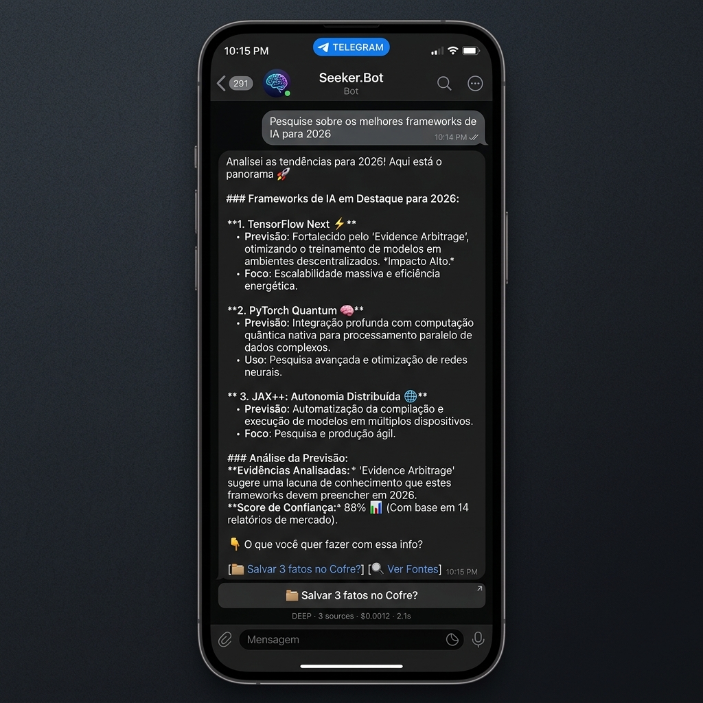
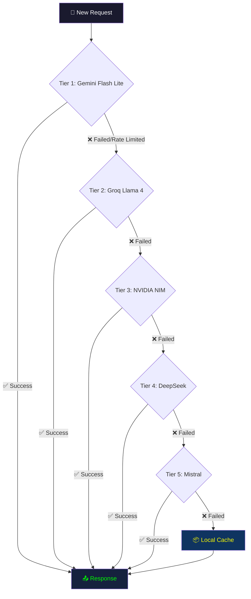
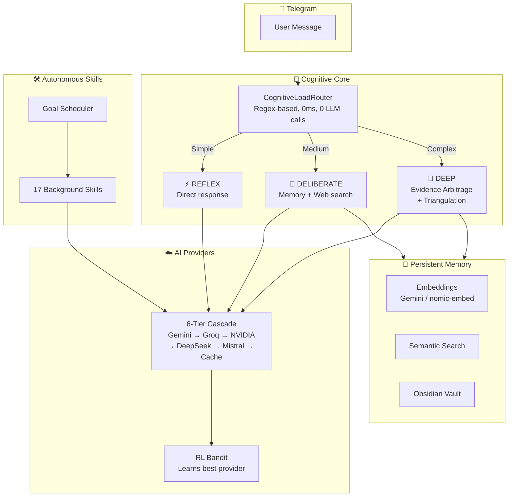

<div align="center">

# 🤖 Seeker.Bot

**Autonomous cognitive agent for Telegram with persistent memory, computer vision, and 14 modular skills.**

[](https://python.org)
[](LICENSE)
[]()
[]()

🇧🇷 [Leia em Português](README.pt-BR.md)



</div>

---

## ✨ What is Seeker?

Seeker.Bot is not a chatbot — it's an **autonomous cognitive agent** that lives in your Telegram. It decides how to think about each message (reflexive, deliberate, or deep analysis), searches the web, remembers everything you've discussed, and runs 14 independent skills in the background — from daily news curation to knowledge management.

What makes it different: a **multi-provider API cascade** that never stops working, a **Reinforcement Learning bandit** that learns which AI model works best for each task, and **Evidence Arbitrage** — triangulating responses from multiple AI providers to catch hallucinations.

You can run it entirely in the cloud with free API tiers, or **100% locally** on your GPU with no internet needed.

---

## 🆕 What's New in v2.0-stable

- **S.A.R.A. Auto-Healing Resiliency:** When the self-improvement loop patches a file, the bot now automatically commands the Watchdog to soft-restart and reload the new code, ensuring zero-downtime hot fixes.
- **Vision Watch Refactor:** The `/watch` and `/watchoff` commands were completely decoupled from the goal engine into standalone async tasks, making desktop monitoring bulletproof and extremely responsive.
- **Enhanced Data Handling:** The Daily Briefing module was upgraded from 1,500 to 4,096 tokens to easily handle 15+ emails without HTML truncation, plus multiple core engine stability fixes (like goal dict iteration fallbacks).

---

## ⚡ Quick Start

```bash
git clone https://github.com/4pixeltechBR/Seeker.Bot
cd Seeker.Bot
install.bat
```

The installer will guide you through everything: naming your assistant, choosing cloud or local mode, and selecting which skills to activate.

---

## 🔑 API Providers & Models

Seeker uses a **multi-provider cascade** — you can use as few as **1 API key** or as many as 6+ providers for maximum resilience.

### Providers

| Provider | Model | Role in Seeker | Free Tier | Get Key |
|---|---|---|---|---|
| **Google Gemini** | `gemini-3.1-flash-lite` | ⚡ FAST (high frequency) | ✅ 15 RPM, 500/day | [aistudio.google.com](https://aistudio.google.com/apikey) |
| **Google Gemini** | `gemini-3-flash` | 🧠 DEEP + ⚖️ JUDGE | ✅ 5 RPM, 20/day | same key |
| **Google Gemini** | `gemini-embedding-001` | 💾 Embeddings (memory) | ✅ 100 RPM | same key |
| **Google Gemini** | `gemini-2.5-flash` | 👁️ Cloud VLM (vision) | ✅ 5 RPM | same key |
| **Groq** | `llama-4-scout-17b` | ⚡ FAST (ultra-fast) | ✅ 30 RPM, 14.4K/day | [console.groq.com](https://console.groq.com/keys) |
| **NVIDIA NIM** | `deepseek-v3.2` | 🧠 DEEP + 📝 SYNTHESIS | ✅ 40 RPM, unlimited | [build.nvidia.com](https://build.nvidia.com/) |
| **NVIDIA NIM** | `nemotron-ultra-253b` | 🧠 DEEP (heavy fallback) | ✅ 40 RPM | same key |
| **NVIDIA NIM** | `qwq-32b` | 🔴 ADVERSARIAL (reasoning) | ✅ 40 RPM | same key |
| **NVIDIA NIM** | `gemma-4-31b-it` | ⚖️ JUDGE + 🔴 ADVERSARIAL | ✅ 40 RPM | same key |
| **DeepSeek** | `deepseek-chat` | 🧠 DEEP (paid backup) | ❌ ~$0.28/1M tok | [platform.deepseek.com](https://platform.deepseek.com/) |
| **DeepSeek** | `deepseek-reasoner` | 🔴 ADVERSARIAL (paid) | ❌ ~$0.28/1M tok | same key |
| **Mistral** | `mistral-small-latest` | ⚖️ JUDGE (fallback) | ✅ 2 RPM | [console.mistral.ai](https://console.mistral.ai/) |
| **Ollama** | `qwen3.5:4b` | 👁️ Local VLM (offline vision) | ✅ 100% local | [ollama.com](https://ollama.com/) |

### Configuration Scenarios

| Scenario | Keys Needed | Result | Monthly Cost |
|---|---|---|---|
| 🟢 **Minimum** | 1× Gemini | Functional, slower at peak | $0 |
| 🟡 **Recommended** | Gemini + Groq + NVIDIA | Fast & resilient. 3 free providers | $0 |
| 🔵 **Full Power** | All 5+ providers | Max speed. Zero downtime. RL Bandit optimizes | ~$2-5 (DeepSeek) |
| 🏠 **100% Local** | None (Ollama only) | Offline, private, no cost | $0 + GPU |

> **Note:** You can run with a SINGLE key (Gemini). Seeker adapts and uses what's available. More providers = more resilience.

---

## 🧠 How the Cascade Works

When Seeker needs to call an AI model, it doesn't rely on a single provider. Instead, it uses a **6-tier cascade with automatic fallback**:



A **Reinforcement Learning Bandit** continuously learns which provider is fastest and most reliable for each cognitive role (FAST, DEEP, JUDGE, etc.) and reorders the cascade in real-time.

---

## 🏠 100% Local Mode (No Internet)

Seeker can run entirely on your computer with **no API keys and no internet**.

### Requirements
- [Ollama](https://ollama.com/) installed
- GPU with sufficient VRAM

### VRAM Profiles

| Your VRAM | FAST Model | DEEP Model | Vision (VLM) | Embeddings |
|---|---|---|---|---|
| **8 GB** | Qwen 3.5 4B | Qwen 3.5 4B | Qwen 3.5 4B | nomic-embed-text |
| **16 GB** | Qwen 3.5 4B | Gemma 4 12B | Qwen 3.5 4B | nomic-embed-text |
| **24 GB+** | Qwen 3.5 4B | Qwen 3.5 27B | Gemma 4 E4B | mxbai-embed-large |

### Setup
```bash
# In your .env:
SEEKER_MODE=local
LOCAL_VRAM_GB=8    # your available VRAM

# Pull models:
ollama pull qwen3.5:4b
ollama pull nomic-embed-text

# Start:
start_watchdog.bat
```

---

## 👁️ Computer Vision

Seeker can see your screen, read text from images, and understand visual content.

- **Without GPU:** Set `GEMINI_VLM_FALLBACK=true` in `.env`. Uses Gemini Flash as cloud VLM.
- **With GPU (4GB+ VRAM):** Install [Ollama](https://ollama.com/) + `ollama pull qwen3.5:4b`. 100% free and offline.

---

## 🛠️ Modular Skills

Skills are autonomous agents that run in the background on a schedule. You choose which ones to activate during installation.

### 🟢 Core (Always Active)
| Skill | Description |
|---|---|
| **Health Monitor** | System health dashboard with real-time metrics |
| **Self-Improvement** | S.A.R.A. — self-healing loop every 6 hours |
| **Daily Briefing** | Morning briefing at 7am with your schedule and priorities |

### 🟡 Recommended
| Skill | Description |
|---|---|
| **Knowledge Vault** | Second Brain — save facts to Obsidian with one tap |
| **Scheduler** | Natural language task scheduling via chat wizard |
| **SenseNews** | AI ecosystem news curation by niche |
| **Sherlock News** | Monitor tech launches and model releases |
| **Bug Analyzer** | Send a traceback, get a root cause analysis |
| **Skill Creator** | Auto-generates new skills from recurring patterns |

### 🔵 Specialist
| Skill | Description | Requires |
|---|---|---|
| **Email Monitor** | Inbox monitoring with smart filtering | IMAP |
| **Desktop Watch** | AFK screen surveillance with pattern detection | VLM |
| **Remote Executor** | Execute complex plans with approval workflow | — |
| **OS Control** | Operating system file and app control | — |
| **Git Automation** | Auto-backup to private GitHub repository | GitHub Token |

---

## 🏗️ Architecture



---

## 📋 Full Installation Guide

### Step 1: Create a Telegram Bot
1. Open Telegram and search for **@BotFather**
2. Send `/newbot`
3. Choose a name (e.g., "My Seeker")
4. Copy the **TOKEN** — you'll need it for `.env`
5. To find your **User ID**: send `/start` to **@userinfobot**

### Step 2: Get API Keys
At minimum, you need **1 key** (Gemini). For best results, get 3 (all free):

| Provider | Steps | Link |
|---|---|---|
| **Google Gemini** | 1. Sign in with Google → 2. Click "Create API Key" | [aistudio.google.com/apikey](https://aistudio.google.com/apikey) |
| **Groq** | 1. Create account → 2. Go to API Keys → 3. Create key | [console.groq.com/keys](https://console.groq.com/keys) |
| **NVIDIA NIM** | 1. Create account → 2. Go to any model → 3. Click "Get API Key" | [build.nvidia.com](https://build.nvidia.com/) |

### Step 3: Clone & Install
```bash
git clone https://github.com/4pixeltechBR/Seeker.Bot
cd Seeker.Bot
install.bat
```

### Step 4: Configure `.env`
The installer opens your `.env` file. Fill in at minimum:
```env
ASSISTANT_NAME=YourAssistantName
TELEGRAM_BOT_TOKEN=your_token_from_botfather
TELEGRAM_ALLOWED_USERS=your_telegram_user_id
GEMINI_API_KEY=your_gemini_key
```

### Step 5: Start
```bash
start_watchdog.bat
```

### Step 6 (Optional): Obsidian Integration
1. Install [Obsidian](https://obsidian.md/)
2. Create a vault
3. Set `OBSIDIAN_VAULT_PATH=C:\Users\You\Obsidian\Vault` in `.env`

### Step 7 (Optional): Git Auto-Backup
1. Create a **private** repository on GitHub
2. Generate a [Personal Access Token](https://github.com/settings/tokens) (repo scope)
3. Set `GITHUB_TOKEN` and `GITHUB_REPO` in `.env`

### Step 8 (Optional): Email Monitoring
1. Go to [Google Account Security](https://myaccount.google.com/security)
2. Enable 2-Factor Authentication
3. Generate an [App Password](https://myaccount.google.com/apppasswords)
4. Fill in SMTP/IMAP fields in `.env`

---

## 🛠️ Built With

- **[Google Antigravity](https://blog.google/technology/google-deepmind/)** — AI-powered development environment
- **[Claude Code](https://claude.ai/)** — Advanced AI pair programming
- **[Python 3.10+](https://python.org)** — Core runtime
- **[aiogram 3](https://aiogram.dev/)** — Async Telegram Bot framework
- **[Ollama](https://ollama.com/)** — Local LLM inference engine

---

## 🙏 Acknowledgments

Seeker.Bot was co-created with AI — and we're proud of it.

| Partner | Contribution |
|---|---|
| **[Google DeepMind](https://deepmind.google/)** | Antigravity (Gemini) — primary development environment and cognitive architecture co-designer |
| **[Anthropic](https://anthropic.com/)** | Claude Code — advanced pair programming, architecture reviews, and code generation |
| **[Ollama](https://ollama.com/)** | Local inference engine enabling 100% offline operation |
| **[Groq](https://groq.com/)** | Ultra-fast inference infrastructure |
| **[NVIDIA](https://nvidia.com/)** | NIM API platform and GPU ecosystem |
| **[DeepSeek](https://deepseek.com/)** | Cost-effective deep reasoning models |
| **[Mistral AI](https://mistral.ai/)** | Resilient fallback provider |

> This project is a testament to what happens when a human creator works alongside AI tools as true partners — not as replacements, but as cognitive amplifiers.

---

## 🤝 Contributing

Contributions are welcome! Please read [CONTRIBUTING.md](CONTRIBUTING.md) for guidelines.

1. Fork the repository
2. Create a feature branch (`git checkout -b feature/amazing-feature`)
3. Commit your changes (`git commit -m 'Add amazing feature'`)
4. Push to the branch (`git push origin feature/amazing-feature`)
5. Open a Pull Request

---

## 📜 License

This project is licensed under the **Apache License 2.0** — see the [LICENSE](LICENSE) file for details.

```
Copyright 2026 4pixeltech / Victor Machado Mendonça
```

---

<div align="center">

**Built with 🧠 by [4pixeltech](https://github.com/4pixeltechBR)**

*If Seeker helped you, consider giving it a ⭐ on GitHub!*

</div>
