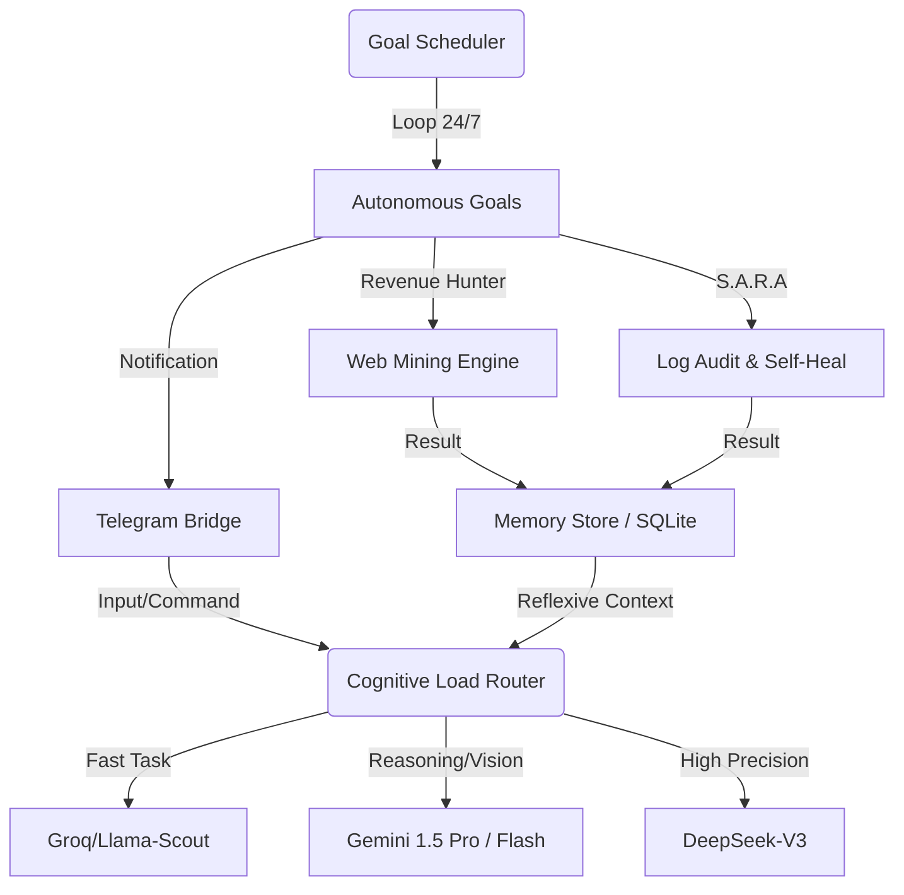

# 🌌 Seeker.ai

<div align="center">
  <h3>O Agente Autônomo Self-Hosted da Era Telegram-First</h3>
  <p><em>Autonomia de Nível 5 — Operação 24/7 — Gestão Dinâmica de Contexto (Zero VRAM Waste)</em></p>
</div>

---

## ⚡ What is Seeker.ai?

**Seeker.ai** is an open-source, self-hosted autonomous AI agent that operates as a persistent background process. Unlike traditional chat assistants that wait for prompts in browser tabs, Seeker.ai lives on your local machine or VPS, communicates directly via Telegram, and proactively executes complex workflows (like web mining, API orchestration, and code review) using a cascaded multi-LLM routing system.

Construído em **Python 3.12+**, ele foi desenhado para contornar a "Barreira do Claw", atuando não apenas como um executor de scripts, mas como um sistema auto-adaptável com Memória Reflexiva e resiliência a falhas incorporada.

## 🚀 Por que escolher o Seeker.ai? (Diferenciais)

A arquitetura do Seeker.ai quebra o modelo tradicional de "Copilot", substituindo-o pelo paradigma de "Autonomous Operation".

| Tradicional (Ex: ChatGPT/Claude) | Seeker.ai (Autonomous Framework) |
| :--- | :--- |
| **Reativo**: Fica aguardando sua tela ou aba aberta. | **Proativo**: Roda 24/7 silenciosamente no background. |
| **Modelo Único**: Usa o modelo principal para todas as tarefas. | **Motor Multi-LLM**: Usa Groq (gratuito/rápido) para triagem e Gemini/DeepSeek para cognição, economizando 90% dos custos. |
| **Amnésia**: O contexto reseta em novas sessões. | **Motor de Decaimento de Memória**: O SQLite armazena fatos, diminui a confiança no que envelhece, mas blinda "Regras Reflexivas" do usuário. |
| **Caixa Preta**: Falha silenciosamente ou responde com erro. | **S.A.R.A (Auto-Cura)**: Tenta corrigir seu próprio código, injeta correções na sua IDE via protocolo MCP e envia o "Porquê" via Raciocínio Aberto no seu Telegram. |

---

## 💎 Power Skills Hub (Módulos Autônomos)

O Seeker.ai não é um script linear; é um ecossistema de **Capabilities** que operam em paralelo via `GoalScheduler`.

| Skill | Emoji | Função Técnica | Output Principal |
| :--- | :--: | :--- | :--- |
| **Revenue Hunter** | 🎯 | Mineração B2B/B2G em 3 fases (Discovery, Enrich, Dossier) com BANT Scoring. | Dossiê Comercial completo + PDF. |
| **S.A.R.A (Auto-Cura)** | 🛠️ | *Systematic Automatic Retrospective Analysis*. Monitora logs e corrige bugs via patches automáticos. | Relatórios de "Raciocínio Aberto" + Auto-Fix. |
| **SenseNews** | 📰 | Curadoria diária (10:00 AM) em 4 nichos com análise cruzada de impacto. | Relatório de Inteligência em PDF. |
| **Vision (AFK)** | 👁️ | Monitoramento visual do desktop e protocolo de presença inteligente. | Contexto visual para decisões. |
| **Skill Creator** | 🧬 | Meta-capacidade de programar, testar e registrar novos Goals autonomamente. | Expansão orgânica do sistema. |
| **ViralClip Bridge** | 🎬 | Identificação de tendências virais e ponte de produção para o ecossistema ViralClip. | Pautas de vídeo validadas. |
| **Git & OS Automator** | 💻 | Gestão de repositórios, deploy e monitoramento de saúde do sistema (HealthCheck). | Sistema 100% íntegro e atualizado. |

---

## 🏗️ Arquitetura Técnica (Lumen & Arq)

O Seeker foi desenhado sob princípios de **Cognitividade Eficiente** e **Resiliência Extrema**.



### 🧠 O Motor de Decisão (Cognitive Load Router)
Para evitar o desperdício de tokens e VRAM, o Seeker avalia a **entropia** da tarefa antes de selecionar o provedor:
- **Fast Role**: Extração de entidades, JSON parsing e roteamento básico (Groq).
- **Synthesis Role**: Geração de relatórios, escrita de código e análise de mercado (DeepSeek/Gemini).
- **Vision Role**: Leitura de tela e interface com o OS (Gemini).

### 💾 Memória Reflexiva
Utilizamos um sistema de **DecayEngine** no SQLite:
1.  **Episódica**: Eventos recentes.
2.  **Semântica**: Fatos persistentes.
3.  **Reflexive Rules**: Fricções de usuário que se tornam leis de comportamento, ignoradas pelo decaimento temporal.

---

## 🚀 Como Criar sua Própria Skill

O Seeker é extensível por design. Basta criar uma pasta em `src/skills/` com um arquivo `goal.py` que implemente a factory `create_goal`.

```python
# Exemplo rápido: src/skills/my_new_skill/goal.py
def create_goal(pipeline):
    return MyCustomGoal(pipeline) # Herdando de AutonomousGoal
```

---

## 🛡️ Segurança (Extreme Trust)

Sempre avalie o código que você fornece autonomia total.
A IA adota um modelo de **Segurança baseada em Fricção**. A classe do motor garante que ações destrutivas pareiem localmente no seu computador, impedindo que "Agentes Independentes" quebrem a estrutura. Todo o dossiê que é abortado gera um LOG analítico JSON te informando o motivo real da exclusão ("Painel de Confiança Extrema e Raciocínio Aberto").

---

*“Um assistente espera no seu navegador. Um partner acorda e reporta ganhos e problemas no seu Telegram antes de você perguntar.”* 

**By 4PixelTech**
