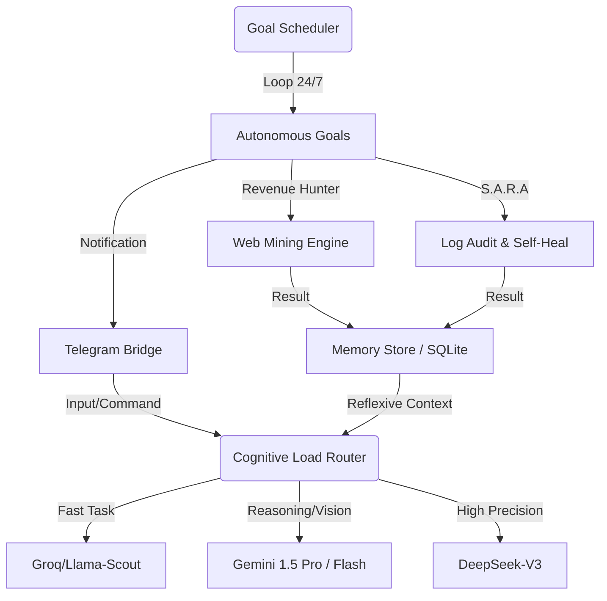

# 🌌 Seeker.Bot

<div align="center">
  <h3>O Agente Autônomo Self-Hosted da Era Telegram-First</h3>
  <p><em>Autonomia de Nível 5 — Operação 24/7 — Gestão Dinâmica de Contexto (Zero VRAM Waste)</em></p>
  <p><strong>Desenvolvido via Vibe Coding 🌊</strong></p>
</div>

---

## ⚡ What is Seeker.Bot?

**Seeker.Bot** is an open-source, self-hosted autonomous AI agent that operates as a persistent background process. Unlike traditional chat assistants that wait for prompts in browser tabs, Seeker.Bot lives on your local machine or VPS, communicates directly via Telegram, and proactively executes complex workflows (like web mining, API orchestration, and code review) using a cascaded multi-LLM routing system.

Construído em **Python 3.12+**, ele foi desenhado para contornar a "Barreira do Claw", atuando não apenas como um executor de scripts, mas como um sistema auto-adaptável com Memória Reflexiva e resiliência a falhas incorporada.

## 🚀 Por que escolher o Seeker.Bot? (Diferenciais)

A arquitetura do Seeker.Bot quebra o modelo tradicional de "Copilot", substituindo-o pelo paradigma de "Autonomous Operation".

| Tradicional (Ex: ChatGPT/Claude) | Seeker.Bot (Autonomous Framework) |
| :--- | :--- |
| **Reativo**: Fica aguardando sua tela ou aba aberta. | **Proativo**: Roda 24/7 silenciosamente no background. |
| **Modelo Único**: Usa o modelo principal para todas as tarefas. | **Motor Multi-LLM**: Usa Groq (gratuito/rápido) para triagem e Gemini/DeepSeek para cognição, economizando 90% dos custos. |
| **Amnésia**: O contexto reseta em novas sessões. | **Motor de Decaimento de Memória**: O SQLite armazena fatos, diminui a confiança no que envelhece, mas blinda "Regras Reflexivas" do usuário. |
| **Caixa Preta**: Falha silenciosamente ou responde com erro. | **S.A.R.A (Auto-Cura)**: Tenta corrigir seu próprio código, injeta correções na sua IDE via protocolo MCP e envia o "Porquê" via Raciocínio Aberto no seu Telegram. |
| **Cloud Dependente**: Seus dados vão para servidores remotos. | **Privacidade Local**: Roda integralmente no seu hardware — banco de dados SQLite local, zero sincronização cloud, seus dados nunca saem da máquina. |
| **Extensibilidade Limitada**: Plugins pré-aprovados apenas. | **Skills Creator Dinâmico**: Crie novas capacidades em linguagem natural — Seeker escreve, testa e registra o código autonomamente. |
| **Vendor Lock-in**: Preso a uma plataforma ou API. | **Multi-Provider + Fallback**: NVIDIA NIM → Groq → Gemini → DeepSeek → Local (Ollama). Mude providers quando quiser, sem reescrever nada. |

---

## 💎 Power Skills Hub (Módulos Autônomos)

O Seeker.Bot não é um script linear; é um ecossistema de **Capabilities** que operam em paralelo via `GoalScheduler`.

| Skill | Emoji | Função Técnica | Output Principal |
| :--- | :--: | :--- | :--- |
| **Revenue Hunter** | 🎯 | Mineração B2B/B2G em 3 fases (Discovery, Enrich, Dossier) com BANT Scoring. | Dossiê Comercial completo + PDF. |
| **S.A.R.A (Auto-Cura)** | 🛠️ | *Systematic Automatic Retrospective Analysis*. Monitora logs e corrige bugs via patches automáticos. | Relatórios de "Raciocínio Aberto" + Auto-Fix. |
| **SenseNews** | 📰 | Curadoria diária (10:00 AM) em nichos escolhidos com análise cruzada de impacto. | Relatório de Inteligência em PDF. |
| **Vision 3.0 (DOM vs Vision)** | 👁️ | Roteamento visual (Cloud/Local/OCR). Executa Takeover via protocolo AFK e extrai bounding boxes precisos sem OCR alucinado. | Contexto visual para decisões exatas no SO. |
| **Skill Creator** | 🧬 | Meta-capacidade de programar, testar e registrar novos Goals autonomamente. | Expansão orgânica do sistema. |
| **Git & OS Automator** | 💻 | Gestão de repositórios, deploy e monitoramento de saúde do sistema (HealthCheck). | Sistema 100% íntegro e atualizado. |

---

## 🚀 Quick Start

### Pré-requisitos
- **Python 3.10+**
- **Telegram Bot** (crie em @BotFather)
- **API Keys** de pelo menos um LLM provider (Groq é gratuito)

### Instalação (5 minutos)

```bash
# 1. Clone
git clone https://github.com/4pixeltech/Seeker.Bot.git
cd Seeker.Bot

# 2. Ambiente virtual
python -m venv .venv
source .venv/bin/activate  # Windows: .venv\Scripts\activate

# 3. Dependências
pip install -e ".[dev]"

# 4. Configure .env
cp .env.example .env
# Edite .env com suas chaves de API:
#   - TELEGRAM_BOT_TOKEN (obrigatório)
#   - GEMINI_API_KEY (para embeddings)
#   - GROQ_API_KEY ou NVIDIA_NIM_API_KEY (para respostas)

# 5. Rode!
python -m src
```

### Primeiros Comandos

Abra seu Telegram e mande mensagens para seu bot:

**Operação:**
```
/start                # Menu de ajuda e primeiros passos
/search Python        # Busca 5 resultados na web
/god                  # Força análise profunda na próxima mensagem
/print                # Screenshot rápido da tela (sem análise)
/watch                # Ativa vigilância visual (AFK Protocol — 2 min)
/watchoff             # Desativa vigilância de tela
```

**Sistema & Inteligência:**
```
/status               # Painel de providers, memória e performance
/saude                # Dashboard detalhado de saúde dos goals
/memory               # Fatos aprendidos sobre você (semântica)
/rate                 # Status dos rate limiters de API
/decay                # Roda limpeza manual de confiança (decay)
/habits               # Padrões de decisão aprendidos
/scout                # Dispara campanha B2B Scout (leads qualificados)
/crm                  # Histórico dos últimos 5 leads qualificados
/configure_news       # Personaliza nichos do SenseNews
```

---

## 🏗️ Arquitetura Técnica (Lumen & Arq)

O Seeker foi desenhado sob princípios de **Cognitividade Eficiente** e **Resiliência Extrema**.



### 🧠 O Motor de Decisão (Cognitive Load Router & Vision Router)
Para evitar o desperdício de tokens e VRAM, o Seeker avalia a **entropia** da tarefa antes de selecionar o provedor:
- **Fast Role**: Extração de entidades, JSON parsing e roteamento básico (Groq).
- **Synthesis Role**: Geração de relatórios, escrita de código e análise de mercado (DeepSeek/Gemini).
- **Vision Role**: Triagem multi-modelo (Vision 3.0):
  - *Task.OCR*: Vai para o especialista (GLM-OCR Zhipu) batendo 94.5% de precisão sub-sec.
  - *Grounding & Description*: Vai para Cloud (Gemini 1.5 Pro) com Fallback Local Inteligente (Qwen2.5-VL) quando VRAM está livre.
  - *DOM vs Visão*: Injeção Javascript P5 para raspar bounding boxes, eliminando 100% de alucinação de clique no "Desktop/Browser Use".

### 💾 Memória Reflexiva
Utilizamos um sistema de **DecayEngine** no SQLite:
1.  **Episódica**: Eventos recentes.
2.  **Semântica**: Fatos persistentes.
3.  **Reflexive Rules**: Fricções de usuário que se tornam leis de comportamento, ignoradas pelo decaimento temporal.

---

## 🧬 Skills Creator — Extensibilidade Dinâmica

O **Skills Creator** é uma meta-skill do Seeker que permite criar **novas capacidades autonomamente** — sem reescrever código, sem restartar o bot.

### Como Funciona

1. **Você descreve** o que quer em linguagem natural
2. **Seeker analisa** o pedido e gera código Python
3. **Sistema testa** a nova skill em sandbox
4. **Auto-registra** a skill no goal engine
5. **Executa** no próximo ciclo

### Exemplos de Skills que Você Pode Criar

| Skill | Descrição | Exemplo de Solicitação |
| :--- | :--- | :--- |
| **Notificações Customizadas** | Monitore eventos e receba alertas | "Monitore a fila de imprimir e me avise se tiver mais de 10 documentos" |
| **Monitores de Website** | Rastreie mudanças em sites | "Acompanhe o preço deste produto no Shopee e me notifique se cair mais de 10%" |
| **Integrações Web** | Conecte a APIs externas | "Sincronize meus leads do CRM com uma planilha Google diária" |
| **Análise de Documentos** | Processe relatórios e PDFs | "Extraia faturas de um email e organize as datas em um banco de dados" |
| **Automações Repetitivas** | Reduza tarefas manuais | "Todos os dias às 9am, envie um email com o status do portfolio de criptos" |

### Exemplo Técnico

```python
# Novo goal criado dinamicamente pelo Seeker:
class MeuMonitorCustomizado(AutonomousGoal):
    """
    Meta-skill: Monitora eventos custom sem re-deploy.
    Código gerado via Language Model + injeção no pipeline.
    """
    async def run_cycle(self) -> GoalResult:
        # Lógica auto-gerada
        event = await self.check_event()
        if event.meets_criteria():
            return GoalResult(success=True, notification=f"Alerta: {event}")
        return GoalResult(success=True, summary="Aguardando...")
```

### Por Que Isso é Revolucionário

- 🚀 **Sem redeploy**: Skill ativa no próximo ciclo de 6h
- 🔒 **Seguro**: Sandbox execution + approval checks
- 📝 **Sem código**: Descreva em português, Seeker implementa
- ♻️ **Reutilizável**: Skills compartilháveis via Git
- 🧠 **Inteligente**: Seeker refina baseado em feedback

---

## 🛡️ Segurança (Extreme Trust)

Sempre avalie o código que você fornece autonomia total.
A IA adota um modelo de **Segurança baseada em Fricção**. A classe do motor garante que ações destrutivas pareiem localmente no seu computador, impedindo que "Agentes Independentes" quebrem a estrutura. Todo o dossiê que é abortado gera um LOG analítico JSON te informando o motivo real da exclusão ("Painel de Confiança Extrema e Raciocínio Aberto").

---

---

## 📚 Documentação

- **[CLAUDE.md](CLAUDE.md)** — Diretrizes de desenvolvimento (para Claude Code)
- **[CONTRIBUTING.md](CONTRIBUTING.md)** — Como contribuir
- **[LICENSE](LICENSE)** — MIT License

---

## 🤝 Contribuições

Seeker.Bot é open-source! Se quer ajudar:
1. Fork este repositório
2. Crie uma branch (`git checkout -b feature/sua-feature`)
3. Commit suas mudanças
4. Abra um Pull Request

Veja [CONTRIBUTING.md](CONTRIBUTING.md) para detalhes.

---

## 🐛 Reportar Bugs / Sugerir Features

- **Bugs**: [GitHub Issues](https://github.com/4pixeltech/Seeker.Bot/issues)
- **Discussões**: [GitHub Discussions](https://github.com/4pixeltech/Seeker.Bot/discussions)

---

## 📊 Status do Projeto

- ✅ **v2.1**: Audited, hardened, production-ready
- ✅ **54+ unit tests** (100% passing)
- ✅ **Health dashboard** para monitoramento em tempo real
- 🚀 **v3.0**: Planned — Web dashboard, mais providers, integração com mais canais

---

*”Um assistente espera no seu navegador. Um partner acorda e reporta ganhos e problemas no seu Telegram antes de você perguntar.”* 

**Criado por Vibe Coding — By 4PixelTech**
